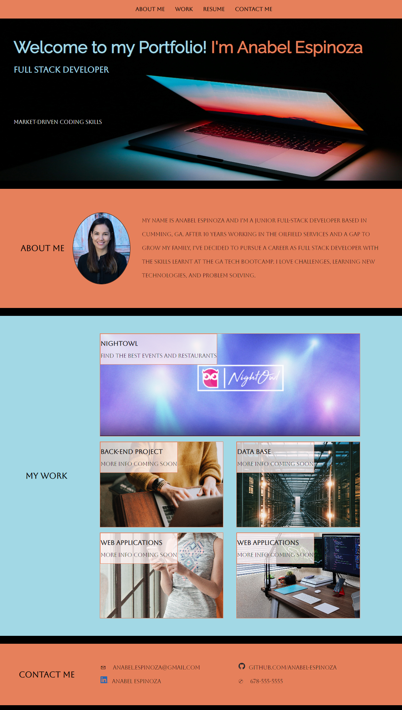

# AEspinoza-Portfolio

## Description

The webpage created is a personal porfolio that will eventually contain deployed web applications. Web developer portfolios are very useful for career search.
There are not real applications to be showcased at the moment, but the website has the structure ready to be updated as the course progresses. The website is responsive, and it contains the following sections: About Me, My Work, and Contact Information.

## Installation

N/A

## Usage

The site is responsive for different screens and devices. It consists of the following parts:
- Navigation bar with the links to the sections: About Me, My Work, Contact Information, and  link to the Resume file.
- My Work section uses placeholder images and titles that will be updated once the developer has real applications to show. The biggest image corresponds to the most important app and for now, it just links to the GitHub profile. 
- Contact Me section has a link email to the developer, to her GitHub profile, phone number, and LinkedIn profile.

**Website link: (https://anabel-espinoza.github.io/AEspinoza-Portfolio/)**

The website looks like the following image:

## Credits

- Website created by: Anabel Espinoza (https://github.com/Anabel-Espinoza)

## License

- MIT License.